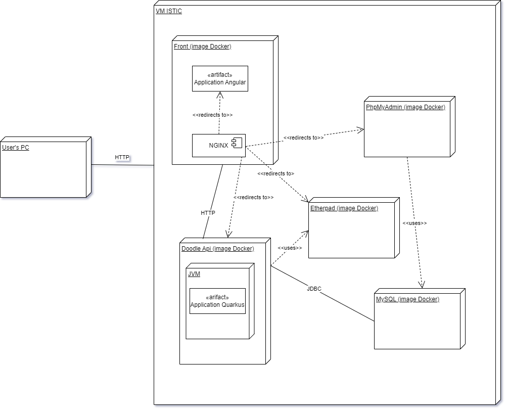

# Projet TLC

Yoann DEWILDE

Ce projet est le déploiement de l'application Doodle sur une machine virtuelle.

# Diagramme de déploiement



# Installation sur VM

Avec `deploy.sh` 
- Modifier la variable `vm` dans le script et y assigner le domaine ou l'IP de la VM.
- Exécuter le script. Le mot de passe est demandé plusieurs fois, pour chaque fichier, c'est normal.

Manuellement :
- Créer le dossier `~/doodle` sur la VM.
- Copier les dossiers `nginx` et `certbot` dans `~/doodle`.
- Copier les fichiers suivants *à la racine* de `~/doodle` :
  - docker-compose.yaml
  - api/APIKEY.txt
  
Vous devez obtenir cette arborescence sur le serveur :

```
~/doodle
├── APIKEY.txt
├── certbot
│   ├── conf
│   ├── log
│   └── www
├── docker-compose.yaml
└── nginx
    ├── admin.conf
    ├── front.conf
    └── pad.conf
```

# Exécution

- Se connecter à la VM.
- Exécuter ces commandes :

```bash
cd ~/doodle
docker compose -f docker-compose.yaml up 
```

# Intégration continue

GitLab CI/CD a été mis en place. A chaque commit sur main :
- Les images sont construites et poussées sur Docker Hub.
- Les fichiers de configuration et docker-compose sont envoyés vers `ydew.istic.univ-rennes1.fr`.
- L'application est lancée en tâche de fond.

# Problèmes rencontrés

## Accès au site

L'adresse http://ydew.diverse-team.fr mène à la page phpMyAdmin. Tandis que les adresses http://doodle.ydew.diverse-team.fr, http://admin.ydew.diverse-team.fr et http://pad.ydew.diverse-team.fr renvoient une erreur DNS_PROBE_FINISHED_NXDOMAIN.

## Utilisation de letsencrypt

Je n'ai pas réussi à faire fonctionner letsencrypt. Voici la commande exécutée pour générer les certificats :

```sh
$ docker compose run --rm letsencrypt certonly --webroot --webroot-path /var/www/certbot --dry-run -d ydew.diverse-team.fr
Saving debug log to /var/log/letsencrypt/letsencrypt.log
Simulating a certificate request for ydew.diverse-team.fr

Certbot failed to authenticate some domains (authenticator: webroot). The Certificate Authority reported these problems:
  Domain: ydew.diverse-team.fr
  Type:   unauthorized
  Detail: 148.60.11.177: Invalid response from http://ydew.diverse-team.fr/.well-known/acme-challenge/tQQMvjYHVJmZBXcWki8lncgiwUtfRAXU7MiLFdyY3Ck: 404
```